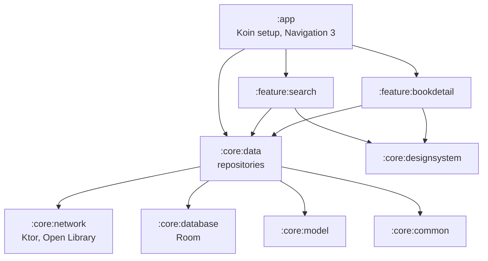

# Shelfie

[](https://github.com/Roland0906/Shelfie/actions/workflows/ci.yml)

An offline-first Android app for finding books and keeping a personal reading shelf, built on the [Open Library](https://openlibrary.org/developers/api) API.

Shelfie is a portfolio project. It has few features on purpose: each one exists to show a design decision that I can explain, such as how the cache stays correct, how errors reach the UI, and how modules are kept apart.

> **Status:** early. Search and book detail work end to end. The shelf has its data layer and tests but no screen yet. See [Roadmap](#roadmap).

## Features

**Search**
- Results appear as you type. The app waits for a 300 ms pause before it sends a request.
- Results load page by page as you scroll. If loading the next page fails, a retry row appears at the end of the list and the rest of the list stays on screen.
- Searching the same query again within 6 hours does not call the API. Queries are normalized first, so `Dune`, ` dune ` and `DUNE` share one cache entry.

**Book detail**
- Cached details appear immediately and are refreshed in the background (stale-while-revalidate).
- A failed refresh keeps the book on screen and shows an error banner.
- Books can be added to the shelf as *Want to read*, *Reading* or *Finished*. The shelf is stored only on the device, so this works offline.

## Architecture



Every screen reads from the database. The network only writes to it.


### Module rules

These rules live in [`build-logic`](build-logic/convention/src/main/kotlin/com/rolandlin/shelfie/buildlogic/ModuleRules.kt). A violation fails Gradle configuration, so it is caught before review.

- Features never depend on each other. Each feature exposes a `Route` composable that takes navigation callbacks, and `:app` turns those callbacks into back stack changes.
- Features reach data only through the `:core:data` interfaces, never through DAOs or the HTTP client.
- `:core:network` and `:core:database` do not know about each other. Combining them is the job of `:core:data`.

### Notable decisions

| Topic | Decision |
|---|---|
| Single source of truth | Repositories expose `Flow`s from Room. Network results reach the UI only after they are written to the database. |
| Search paging | Paging 3 with a `RemoteMediator`. The UI always reads Room's `PagingSource`, so the last results stay visible when the network fails. |
| Errors | Ktor exceptions are mapped to a small `DataError` type (`Offline`, `NotFound`, `RateLimited`, `Server`, `Unknown`) in `:core:network`, so no Ktor type reaches a feature. |
| Cancellation | `suspendRunCatching` rethrows `CancellationException`. A refresh that is cancelled because its ViewModel was cleared is therefore not reported as a failure. |
| Rate limiting | A Ktor plugin keeps at least 350 ms between requests, including retries. Every request sends an identifying User-Agent, as Open Library asks. |
| Shelf data | Shelf entries copy the title, authors and cover when the book is added, and have no foreign key to the book cache. Clearing the cache never empties the shelf. |
| Shelf rules | How progress and status affect each other (for example, 100% means *Finished*) lives in one place, `ShelfEntry`, and is unit tested. |
| Time | All TTL checks go through an injectable `Clock`, so tests control time. |

## Tech stack

Kotlin, Jetpack Compose (Material 3), Navigation 3, Koin, Ktor (OkHttp engine), kotlinx.serialization, Room (with the bundled SQLite driver), Paging 3 and Coil.

Builds use Gradle convention plugins in [`build-logic`](build-logic) and a version catalog.

## Project structure

```
app/                  Application, MainActivity, navigation
feature/search/       Search screen and ViewModel
feature/bookdetail/   Book detail screen and ViewModel
core/data/            BookRepo, ShelfRepo, RemoteMediator, cache policy
core/network/         Open Library API, HTTP client, rate limiter, DTOs
core/database/        Room database, DAOs, entities, exported schema
core/model/           Domain models (Book, ShelfEntry, ids)
core/common/          Outcome, DataError, Clock
core/designsystem/    Theme and shared components
core/testing/         Fake repositories and test rules
build-logic/          Convention plugins and module rules
```

## Building

Requirements: a recent Android Studio, or JDK 17 or newer with the Android SDK (compile SDK 37, min SDK 24). The build needs no API key.

```bash
./gradlew :app:installDebug      # build and install on a connected device
./gradlew testDebugUnitTest      # run all unit tests
```

## Testing

- **Repositories and the RemoteMediator** are tested against in-memory fake DAOs and a scriptable fake Open Library API. The tests cover cache hits, TTL expiry, paging, offline failures and partial author failures.
- **ViewModels** are tested with fake repositories from `:core:testing`.
- **UI state** is computed by pure functions (`SearchListState.from`, `BookDetailUiState.from`), so every screen state has a plain unit test.
- **Network**: DTO parsing, error mapping and the rate limiter are tested with Ktor's `MockEngine` and coroutine virtual time.

The project uses fakes instead of mocking libraries, so tests check the state that results from a call rather than which calls were made.

## Roadmap

- [x] Multi-module build with convention plugins and enforced module rules
- [x] Offline-first data layer
- [x] Search and book detail
- [ ] Shelf screen with progress and notes, and periodic metadata refresh with WorkManager
- [ ] Discover screen, adaptive multi-pane layouts, Baseline Profile and Macrobenchmark
- [ ] Kotlin Multiplatform: shared data layer and an iOS app
- [ ] On-device AI reading summaries with a cloud fallback
- [x] CI
- [ ] Architecture decision records

## Known limitations

- The shelf is not synced. It is stored only on the device, and there is no account.
- Search pages by offset against Open Library's current ranking. If the ranking changes between page loads, a book can be skipped.

## Data source

Book data comes from [Open Library](https://openlibrary.org/), an Internet Archive project.
